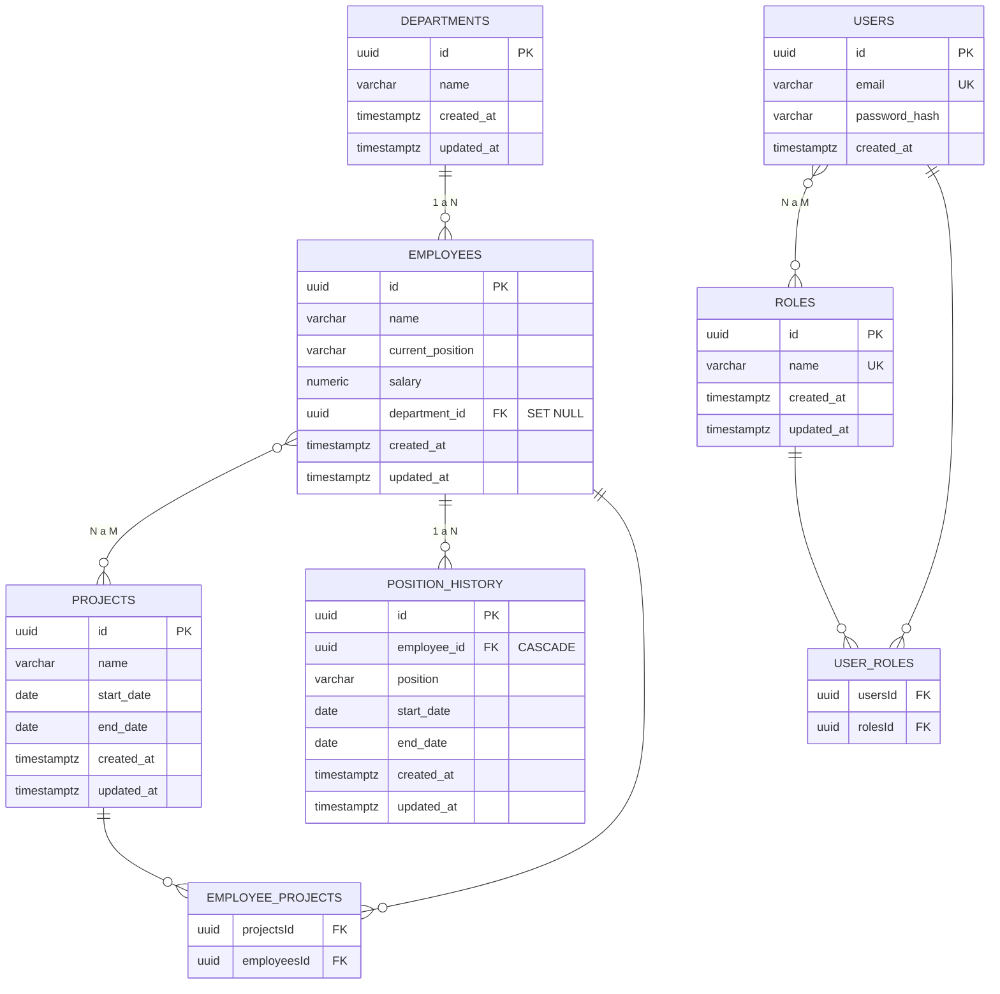

# employee-management-api-node

[](#)
[](#)

Recreación en **Node.js/TypeScript** de una API de gestión de empleados.

## Objetivo

Construir una API para la administración de empleados aplicando los principios de **Clean Architecture**: separación clara entre dominio, aplicación e infraestructura, con independencia de frameworks y detalles de persistencia.

## Stack

- **Runtime:** Node.js + TypeScript
- **HTTP:** Fastify
- **ORM:** TypeORM
- **Base de datos:** PostgreSQL
- **Arquitectura:** Clean Architecture (domain / application / infrastructure)
- **Testing:** Jest + Supertest

## Configuración

Las variables de entorno del proyecto están documentadas en `.env.example`. Para trabajar en local, cópialo a `.env` y ajusta los valores:

```bash
cp .env.example .env
```

| Variable         | Descripción                                        |
| ---------------- | -------------------------------------------------- |
| `NODE_ENV`       | Entorno de ejecución (`development`, `production`) |
| `PORT`           | Puerto HTTP de la API                              |
| `DB_HOST`        | Host de PostgreSQL                                 |
| `DB_PORT`        | Puerto de PostgreSQL                               |
| `DB_USER`        | Usuario de la base de datos                        |
| `DB_PASSWORD`    | Contraseña de la base de datos                     |
| `DB_NAME`        | Nombre de la base de datos                         |
| `JWT_SECRET`     | Secreto para firmar los tokens JWT                 |
| `JWT_EXPIRES_IN` | Expiración de los tokens JWT (ej. `1d`, `12h`)     |

El archivo `.env` está ignorado por git: nunca lo commitees con valores reales.

## Arranque con Docker

Levanta la API y PostgreSQL con un solo comando:

```bash
docker compose up --build
```

### Servicios y puertos

| Servicio | Puerto expuesto | Descripción            |
| -------- | --------------- | ---------------------- |
| `api`    | `8080`          | API Fastify (HTTP)     |
| `db`     | `5432`          | PostgreSQL 16 (Alpine) |

### Credenciales de la base de datos (seed)

| Campo    | Valor                 |
| -------- | --------------------- |
| Host     | `localhost`           |
| Puerto   | `5432`                |
| Usuario  | `employee`            |
| Password | `employee`            |
| DB       | `employee_management` |

### Atajos con Make

```bash
make up        # docker compose up -d --build
make down      # docker compose down
make logs      # docker compose logs -f api
make test      # npm test
make migrate   # npm run migration:run
```

### Hot-reload en desarrollo

En desarrollo se aplica automáticamente `docker-compose.override.yml`, que monta `src/` como volumen y ejecuta `tsx watch` para hot-reload.

## Migraciones de base de datos

TypeORM opera en modo **migraciones explícitas** (`synchronize: false`). Esto significa que el esquema de la base de datos **nunca se modifica automáticamente** — cada cambio debe ser generado como una migración y aplicado de forma controlada.

### ¿Por qué `synchronize: false`?

- `synchronize: true` altera tablas automáticamente al reiniciar la app, lo cual puede causar **pérdida de datos** en producción
- Las migraciones dan **control total**: cada cambio es un archivo versionado, auditable y revirtible
- Permite aplicar cambios de schema **antes o después** del deploy, no solo al iniciar la app

### Flujo de trabajo

**1. Modificar una entidad** (ej. agregar una columna en `src/infrastructure/database/entities/`)

**2. Generar la migración** comparando el estado de las entidades contra la DB:

```bash
npm run build
npm run migration:generate -- src/infrastructure/database/migrations/20260825-add-description-to-questions
```

TypeORM compara las entidades compiladas contra el esquema actual y genera el archivo de migración con los `UP` y `DOWN` necesarios.

**3. Revisar el archivo generado** en `src/infrastructure/database/migrations/`

**4. Aplicar la migración:**

```bash
npm run migration:run
```

**5. Revertir si es necesario:**

```bash
npm run migration:revert
```

**6. Verificar estado de migraciones:**

```bash
npm run migration:show
```

### Scripts disponibles

| Script                                 | Descripción                              |
| -------------------------------------- | ---------------------------------------- |
| `npm run migration:generate -- <path>` | Genera migración desde diff de entidades |
| `npm run migration:run`                | Aplica migraciones pendientes            |
| `npm run migration:revert`             | Revierte la última migración aplicada    |
| `npm run migration:show`               | Lista migraciones y su estado            |

### Archivos de migración

```
src/infrastructure/database/migrations/
├── 20260824000000-create-new-questions-system.ts
├── 20260825000000-initial-setup.ts
└── 20260826000000-create-domain-entities.ts
```

Cada archivo exporta una clase con `up()` (aplicar) y `down()` (revertir). Las migraciones se ejecutan en orden cronológico.

## Autenticación y autorización

La API usa **JWT Bearer tokens** para autenticación y **roles** para autorización, replicando el modelo de **ASP.NET Identity + JWT** del proyecto .NET original. Un token firmado enmarca la identidad del usuario (id, email) y los roles que posee, y debe enviarse en cada petición protegida mediante el encabezado `Authorization: Bearer <token>`.

Existen dos roles definidos en `src/application/constants/roles.ts`:

| Rol     | Descripción                                   |
| ------- | --------------------------------------------- |
| `Admin` | Acceso administrativo (usuarios, roles, etc.) |
| `User`  | Rol por defecto asignado a nuevos registros   |

### Endpoints

| Método | Ruta                 | Requiere auth | Descripción                               |
| ------ | -------------------- | ------------- | ----------------------------------------- |
| `POST` | `/api/auth/register` | No            | Registra un usuario nuevo — `201`         |
| `POST` | `/api/auth/login`    | No            | Inicia sesión y devuelve un token — `200` |

### Registro

Crea una cuenta. El rol `User` se asigna automáticamente al nuevo usuario.

**Body** (validado con Zod):

| Campo      | Validación          |
| ---------- | ------------------- |
| `email`    | Email válido        |
| `password` | Mínimo 8 caracteres |

```bash
curl -X POST http://localhost:8080/api/auth/register \
  -H "Content-Type: application/json" \
  -d '{"email":"user@example.com","password":"Secret123"}'
```

**Respuesta `201`:**

```json
{
  "token": "eyJhbGciOiJIUzI1NiIsInR5cCI6IkpXVCJ9...",
  "expiresAt": "2026-09-03T10:15:30.000Z"
}
```

El flujo del servicio (`AuthService.register`) es: verificar que el email no esté en uso → buscar el rol `User` en la base de datos → hashear la contraseña con `bcrypt` (10 rondas) → crear el usuario → firmar el JWT.

**Errores posibles:**

| Código HTTP | Motivo                                   |
| ----------- | ---------------------------------------- |
| `400`       | Datos inválidos (no pasan la validación) |
| `409`       | El email ya está registrado              |
| `500`       | El rol por defecto no está configurado   |

### Login

Autentica las credenciales y devuelve los tokens de acceso.

**Body** (validado con Zod):

| Campo      | Validación   |
| ---------- | ------------ |
| `email`    | Email válido |
| `password` | No vacío     |

```bash
curl -X POST http://localhost:8080/api/auth/login \
  -H "Content-Type: application/json" \
  -d '{"email":"user@example.com","password":"Secret123"}'
```

**Respuesta `200`:**

```json
{
  "token": "eyJhbGciOiJIUzI1NiIsInR5cCI6IkpXVCJ9...",
  "expiresAt": "2026-09-03T10:15:30.000Z"
}
```

El flujo del servicio (`AuthService.login`) es: buscar el usuario por email → comparar la contraseña con `bcrypt.compare` → mapear los roles del usuario → firmar el JWT.

**Errores posibles:**

| Código HTTP | Motivo                 |
| ----------- | ---------------------- |
| `400`       | Datos inválidos        |
| `401`       | Credenciales inválidas |

> Por seguridad, el login devuelve `401` tanto si el email no existe como si la contraseña es incorrecta, sin revelar cuál de los dos falló.

### Uso del token

Incluye el token en las peticiones a rutas protegidas:

```bash
curl http://localhost:8080/api/employees \
  -H "Authorization: Bearer <token>"
```

El middleware (`jwt-auth.ts`) valida la firma y la expiración en cada petición protegida:

| Código HTTP | Motivo                                          |
| ----------- | ----------------------------------------------- |
| `401`       | Token ausente, inválido, mal formado o expirado |
| `403`       | Token válido pero rol insuficiente              |

### Payload del JWT

Los tokens se firman con **HS256** usando `JWT_SECRET` y expiran según `JWT_EXPIRES_IN` (configurables en `.env`).

```json
{
  "sub": "3f0e2c8a-...",
  "email": "user@example.com",
  "jti": "9b2d1f4e-...",
  "roles": ["User"],
  "iat": 1756000000,
  "exp": 1756086400
}
```

| Claim   | Descripción                          |
| ------- | ------------------------------------ |
| `sub`   | Identificador del usuario (UUID)     |
| `email` | Email del usuario                    |
| `jti`   | Identificador único del token (UUID) |
| `roles` | Roles asociados al usuario           |
| `iat`   | Timestamp de emisión                 |
| `exp`   | Timestamp de expiración              |

### Control de acceso por rol

El plugin `jwt-auth.ts` proporciona dos decoradores de Fastify para proteger rutas:

- **`authenticate`** — verifica que el token Bearer sea válido. Devuelve `401` si falla.
- **`requireRole(...roles)`** — verifica el token **y** que `request.user.roles` incluya al menos uno de los roles requeridos. Devuelve `401` si el token es inválido o `403` si el rol no es suficiente.

```typescript
// Ruta accesible solo para administradores
fastify.post('/api/admin/users', { preHandler: [fastify.requireRole(Roles.Admin)] }, handler);

// Ruta accesible para cualquier usuario autenticado
fastify.get('/api/me', { preHandler: [fastify.authenticate] }, handler);
```

**Resumen de códigos de error de autenticación:**

| Código HTTP | Significado                                             |
| ----------- | ------------------------------------------------------- |
| `400`       | Validación de entrada fallida (registro/login)          |
| `401`       | Token ausente/inválido/expirado o credenciales erróneas |
| `403`       | Token válido pero sin el rol requerido                  |
| `409`       | Email ya registrado                                     |
| `500`       | Rol por defecto no configurado                          |

## Endpoints

Tabla completa de los endpoints expuestos por la API. La columna **Rol** indica el rol requerido para acceder a la ruta; las rutas de lectura (`GET`) admiten `Admin` y `User`, las de escritura (`POST`, `PUT`, `DELETE`) solo `Admin`, y las de autenticación no requieren token.

### Autenticación

| Método | Ruta                 | Rol     | Descripción                               |
| ------ | -------------------- | ------- | ----------------------------------------- |
| `POST` | `/api/auth/register` | Ninguno | Registra un usuario nuevo — `201`         |
| `POST` | `/api/auth/login`    | Ninguno | Inicia sesión y devuelve un token — `200` |

### Empleados

| Método   | Ruta                                     | Rol             | Descripción                                                |
| -------- | ---------------------------------------- | --------------- | ---------------------------------------------------------- |
| `GET`    | `/api/employees`                         | `Admin`, `User` | Lista empleados con su bonificación — `200`                |
| `GET`    | `/api/employees/:id`                     | `Admin`, `User` | Obtiene un empleado por id — `200`                         |
| `GET`    | `/api/employees/:id/position-history`    | `Admin`, `User` | Historial de posiciones del empleado — `200`               |
| `POST`   | `/api/employees/:id/position-history`    | `Admin`         | Registra una posición y cierra la anterior — `201` / `400` |
| `POST`   | `/api/employees`                         | `Admin`         | Crea un empleado — `201` / `400`                           |
| `PUT`    | `/api/employees/:id`                     | `Admin`         | Actualiza un empleado — `200` / `400`                      |
| `DELETE` | `/api/employees/:id`                     | `Admin`         | Elimina un empleado — `204` / `404`                        |
| `POST`   | `/api/employees/:id/projects/:projectId` | `Admin`         | Asigna un empleado a un proyecto — `201` / `404`           |
| `DELETE` | `/api/employees/:id/projects/:projectId` | `Admin`         | Desasigna un empleado de un proyecto — `204` / `404`       |

### Departamentos

| Método   | Ruta                                           | Rol             | Descripción                                          |
| -------- | ---------------------------------------------- | --------------- | ---------------------------------------------------- |
| `GET`    | `/api/departments`                             | `Admin`, `User` | Lista departamentos — `200`                          |
| `GET`    | `/api/departments/:id`                         | `Admin`, `User` | Obtiene un departamento por id — `200`               |
| `GET`    | `/api/departments/:id/employees-with-projects` | `Admin`, `User` | Empleados del departamento con sus proyectos — `200` |
| `POST`   | `/api/departments`                             | `Admin`         | Crea un departamento — `201` / `400`                 |
| `PUT`    | `/api/departments/:id`                         | `Admin`         | Actualiza un departamento — `200` / `400`            |
| `DELETE` | `/api/departments/:id`                         | `Admin`         | Elimina un departamento — `204` / `404`              |

### Proyectos

| Método   | Ruta                | Rol             | Descripción                           |
| -------- | ------------------- | --------------- | ------------------------------------- |
| `GET`    | `/api/projects`     | `Admin`, `User` | Lista proyectos — `200`               |
| `GET`    | `/api/projects/:id` | `Admin`, `User` | Obtiene un proyecto por id — `200`    |
| `POST`   | `/api/projects`     | `Admin`         | Crea un proyecto — `201` / `400`      |
| `PUT`    | `/api/projects/:id` | `Admin`         | Actualiza un proyecto — `200` / `400` |
| `DELETE` | `/api/projects/:id` | `Admin`         | Elimina un proyecto — `204` / `404`   |

> Las rutas protegidas requieren el encabezado `Authorization: Bearer <token>` (ver [Autenticación y autorización](#autenticación-y-autorización)). Devuelven `401` si el token falta o es inválido y `403` si el token es válido pero el rol es insuficiente.

## Database Schema

El esquema de persistencia para el dominio de empleados está modelado con TypeORM. Las columnas usan `snake_case` en base de datos y `camelCase` en código; las claves primarias son UUID con `uuid_generate_v4()`; los timestamps `created_at` / `updated_at` usan `timestamptz`.

### Entidades

| Entidad                 | Tabla              | Clave primaria | Relaciones                                                        |
| ----------------------- | ------------------ | -------------- | ----------------------------------------------------------------- |
| `EmployeeEntity`        | `employees`        | `id` (uuid)    | N:1 → `departments` · N:M → `projects` · 1:N → `position_history` |
| `DepartmentEntity`      | `departments`      | `id` (uuid)    | 1:N → `employees`                                                 |
| `ProjectEntity`         | `projects`         | `id` (uuid)    | N:M → `employees`                                                 |
| `PositionHistoryEntity` | `position_history` | `id` (uuid)    | N:1 → `employees`                                                 |
| `UserEntity`            | `users`            | `id` (uuid)    | N:M → `roles`                                                     |
| `RoleEntity`            | `roles`            | `id` (uuid)    | N:M → `users`                                                     |

### Relaciones y reglas de borrado (`onDelete`)

| Relación                     | Tipo         | `onDelete`              | Comportamiento al eliminar el padre                                                                                               |
| ---------------------------- | ------------ | ----------------------- | --------------------------------------------------------------------------------------------------------------------------------- |
| `Employee → Department`      | `ManyToOne`  | `SET NULL`              | El empleado queda sin departamento (`department_id` = NULL)                                                                       |
| `PositionHistory → Employee` | `ManyToOne`  | `CASCADE`               | Se eliminan todos los registros del empleado                                                                                      |
| `Project ↔ Employee`         | `ManyToMany` | `CASCADE` / `NO ACTION` | Se limpia la fila de la tabla intermedia al borrar el proyecto; los empleados no se ven afectados                                 |
| `User ↔ Role`                | `ManyToMany` | `CASCADE`               | Al borrar un usuario o un rol se limpia la fila en la tabla intermedia `user_roles` (equivalente simplificado a ASP.NET Identity) |

- **`SET NULL`** en `Employee → Department`: eliminar un departamento no destruye a sus empleados; quedan desasignados y pueden reasignarse manualmente.
- **`CASCADE`** en `PositionHistory → Employee`: el historial de posiciones es intrínsecamente dependiente del empleado.
- La tabla intermedia `employee_projects` usa `ON DELETE CASCADE` hacia `projects` y no afecta a la entidad `employees` al eliminarse un proyecto.
- La tabla intermedia `user_roles` usa `ON DELETE CASCADE` hacia ambas tablas: permite que cada usuario tenga múltiples roles y que los roles se reutilicen entre usuarios.

### Diagrama entidad-relación



### Índices

Los índices se definen explícitamente en las columnas de claves foráneas para acelerar los JOINs y la búsqueda por relación:

| Índice                      | Tabla               | Columna         |
| --------------------------- | ------------------- | --------------- |
| `IDX_678a3540f843823784b0f` | `employees`         | `department_id` |
| `IDX_a6fd2cf9f5d0e79a05a2a` | `position_history`  | `employee_id`   |
| `IDX_e1e40bcc8b98bf014953e` | `employee_projects` | `projectsId`    |
| `IDX_0e4f579cd84295044f160` | `employee_projects` | `employeesId`   |
| `IDX_user_roles_usersId`    | `user_roles`        | `usersId`       |
| `IDX_user_roles_rolesId`    | `user_roles`        | `rolesId`       |

> Además de estas tablas de dominio, el esquema incluye el subsistema de preguntas (`new_questions`, `new_selections`, `new_translations`, `new_user_responses`), creado por la migración `CreateNewQuestionsSystem20260824000000`, y el subsistema de autenticación (`users`, `roles`, `user_roles`), creado por la migración `CreateUsersRoles20260827000000`.

## Arquitectura

Estructura basada en Clean Architecture:

```
src/
├── api/              # Controllers y rutas Fastify, middleware, composition root
├── application/      # Interfaces (puertos), DTOs, servicios/casos de uso, patrones
├── domain/           # Entidades y enums — sin dependencias externas
└── infrastructure/   # TypeORM, repositorios, JWT
    └── database/
        ├── entities/
        └── migrations/
```

### Regla de dependencias

Las dependencias apuntan siempre hacia adentro, hacia el dominio:

```
api → infrastructure → application → domain
```

- **domain** no depende de ninguna otra capa ni del framework
- **application** solo puede importar de `domain`
- **infrastructure** implementa los puertos definidos en `application` y `domain`
- **api** orquesta el flujo e inyecta las dependencias


### Patrón Strategy + Factory para bonificaciones

El cálculo de bonificaciones por tipo de posición usa una combinación de **Strategy + Factory**, replicando el diseño del proyecto .NET original. Cada tipo de posición tiene su propia estrategia de cálculo y una fábrica central selecciona la estrategia correcta a partir de la posición del empleado.

#### Componentes

| Componente                     | Responsabilidad                                                                        |
| ------------------------------ | -------------------------------------------------------------------------------------- |
| `IBonusStrategy`               | Contrato de estrategia: `positionType` + `calculateBonus(salary)`                      |
| `RegularEmployeeBonusStrategy` | 10% del salario (posición `Regular`)                                                   |
| `ManagerBonusStrategy`         | 20% del salario (posición `Manager`)                                                   |
| `SeniorManagerBonusStrategy`   | 25% del salario (posición `SeniorManager`)                                             |
| `BonusCalculatorFactory`       | Recibe las estrategias inyectadas y delega el cálculo según `employee.currentPosition` |
| `IBonusCalculator`             | Contrato de alto nivel: `calculateBonus(employee)`                                     |

Las estrategias residen en `src/application/bonuses/` y se registran en el contenedor tsyringe (`src/infrastructure/di/container.ts`), que inyecta todas las estrategias al factory:

```typescript
const strategies: IBonusStrategy[] = [
  new RegularEmployeeBonusStrategy(),
  new ManagerBonusStrategy(),
  new SeniorManagerBonusStrategy(),
];

deps.register(BonusStrategiesToken, { useValue: strategies });
deps.register(BonusCalculatorFactory, BonusCalculatorFactory);
```

#### Cómo funciona la selección

El factory construye un `Map<PositionType, IBonusStrategy>` a partir de las estrategias inyectadas y, en `calculateBonus(employee)`, mapea `employee.currentPosition` (string) a su `PositionType` y delega el cálculo en la estrategia correspondiente:

```typescript
calculateBonus(employee: Employee): number {
  const strategy = this.findStrategy(employee.currentPosition);
  return strategy.calculateBonus(employee.salary);
}
```

Si `currentPosition` no se corresponde con ninguna estrategia registrada, el factory lanza `BonusStrategyNotFoundError` (un error controlado de dominio) indicando la posición.

#### Principio Open/Closed (abierto a extensión, cerrado a modificación)

El patrón cumple el **principio Open/Closed (SOLID)**: se puede añadir un nuevo tipo de posición **sin modificar el código existente** del factory ni de las demás estrategias.

Para agregar, por ejemplo, una posición `Director` con un bono del 30%:

1. **Añade el valor al enum** `PositionType`:
   ```typescript
   export enum PositionType {
     Regular = 1,
     Manager = 2,
     SeniorManager = 3,
     Director = 4,
   }
   ```
2. **Crea una nueva estrategia** que implemente `IBonusStrategy`:
   ```typescript
   @injectable()
   export class DirectorBonusStrategy implements IBonusStrategy {
     readonly positionType = PositionType.Director;

     calculateBonus(salary: number): number {
       return salary * 0.3;
     }
   }
   ```
3. **Registra la nueva estrategia** en el contenedor de DI (`container.ts`), añadiéndola al array de estrategias:
   ```typescript
   const strategies: IBonusStrategy[] = [
     new RegularEmployeeBonusStrategy(),
     new ManagerBonusStrategy(),
     new SeniorManagerBonusStrategy(),
     new DirectorBonusStrategy(),
   ];
   ```

El factory y las estrategias existentes **no se tocan**: la nueva estrategia se descubre automáticamente al construir el `Map` en la fábrica. Esto mantiene el código existente estable (cerrado a modificación) y permite extender el comportamiento (abierto a extensión).

> El bono también puede calcularse a través del contenedor de DI con `resolveBonusCalculator()`, que devuelve una instancia del `BonusCalculatorFactory` con todas las estrategias ya inyectadas.

### Equivalencias con la versión .NET original

| Original (.NET)                     | Este proyecto (Node.js)                  |
| ----------------------------------- | ---------------------------------------- |
| `EmployeeManagement.Domain`         | `src/domain/`                            |
| `EmployeeManagement.Application`    | `src/application/`                       |
| `EmployeeManagement.Infrastructure` | `src/infrastructure/`                    |
| `EmployeeManagement.Api`            | `src/api/`                               |
| EF Core                             | TypeORM                                  |
| Controllers de ASP.NET Core         | Rutas y handlers de Fastify              |
| ASP.NET Identity + JWT              | Autenticación JWT                        |
| xUnit + Moq (`tests/`)              | Jest + Supertest (`tests/`, planificado) |

## Estado del proyecto

🚧 En construcción — diseño de dominio y persistencia con entidades de empleados, departamentos, proyectos e historial de posiciones ya modeladas, junto con el subsistema de autenticación y autorización (registro, login y control de acceso por roles con JWT Bearer) y el cálculo de bonificaciones por tipo de posición (patrón Strategy + Factory con inyección de dependencias).
