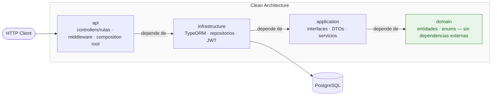

# employee-management-api-node

[](#)
[](#)

Recreación en **Node.js/TypeScript** de una API de gestión de empleados.

## Objetivo

Construir una API para la administración de empleados aplicando los principios de **Clean Architecture**: separación clara entre dominio, aplicación e infraestructura, con independencia de frameworks y detalles de persistencia.

## Stack

- **Runtime:** Node.js + TypeScript
- **HTTP:** Fastify
- **ORM:** TypeORM
- **Base de datos:** PostgreSQL
- **Arquitectura:** Clean Architecture (domain / application / infrastructure)
- **Testing:** Jest + Supertest

## Arquitectura

Estructura basada en Clean Architecture:

```
src/
├── api/              # Controllers y rutas Fastify, middleware, composition root
├── application/      # Interfaces (puertos), DTOs, servicios/casos de uso, patrones
├── domain/           # Entidades y enums — sin dependencias externas
└── infrastructure/   # TypeORM, repositorios, JWT
    └── database/
        ├── entities/
        └── migrations/
```

### Regla de dependencias

Las dependencias apuntan siempre hacia adentro, hacia el dominio:

```
api → infrastructure → application → domain
```

- **domain** no depende de ninguna otra capa ni del framework
- **application** solo puede importar de `domain`
- **infrastructure** implementa los puertos definidos en `application` y `domain`
- **api** orquesta el flujo e inyecta las dependencias



### Equivalencias con la versión .NET original

| Original (.NET)                     | Este proyecto (Node.js)                  |
| ----------------------------------- | ---------------------------------------- |
| `EmployeeManagement.Domain`         | `src/domain/`                            |
| `EmployeeManagement.Application`    | `src/application/`                       |
| `EmployeeManagement.Infrastructure` | `src/infrastructure/`                    |
| `EmployeeManagement.Api`            | `src/api/`                               |
| EF Core                             | TypeORM                                  |
| Controllers de ASP.NET Core         | Rutas y handlers de Fastify              |
| ASP.NET Identity + JWT              | Autenticación JWT                        |
| xUnit + Moq (`tests/`)              | Jest + Supertest (`tests/`, planificado) |

## Estado del proyecto

🚧 En construcción — fase inicial de diseño de dominio y persistencia.
