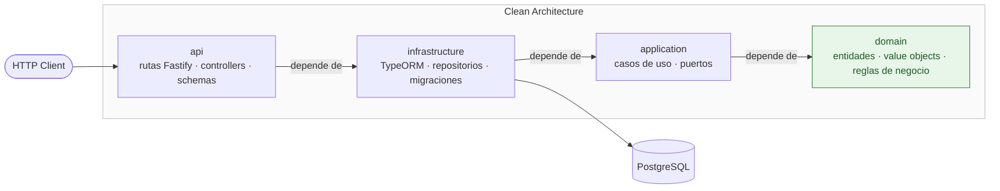

# employee-management-api-node

[](#)
[](#)

Recreación en **Node.js/TypeScript** de una API de gestión de empleados.

## Objetivo

Construir una API para la administración de empleados aplicando los principios de **Clean Architecture**: separación clara entre dominio, aplicación e infraestructura, con independencia de frameworks y detalles de persistencia.

## Stack

- **Runtime:** Node.js + TypeScript
- **HTTP:** Fastify
- **ORM:** TypeORM
- **Base de datos:** PostgreSQL
- **Arquitectura:** Clean Architecture (domain / application / infrastructure)
- **Testing:** Jest + Supertest

## Arquitectura

Estructura basada en Clean Architecture:

```
src/
├── api/              # Capa de entrada: rutas Fastify, controllers, schemas HTTP
├── application/      # Casos de uso y puertos de la aplicación
├── domain/           # Entidades, value objects y reglas de negocio puras
└── infrastructure/   # Detalles técnicos: TypeORM, repositorios, servicios externos
    └── database/
        ├── entities/
        └── migrations/
```

### Regla de dependencias

Las dependencias apuntan siempre hacia adentro, hacia el dominio:

```
api → infrastructure → application → domain
```

- **domain** no depende de ninguna otra capa ni del framework
- **application** solo puede importar de `domain`
- **infrastructure** implementa los puertos definidos en `application` y `domain`
- **api** orquesta el flujo e inyecta las dependencias



## Estado del proyecto

🚧 En construcción — fase inicial de diseño de dominio y persistencia.
